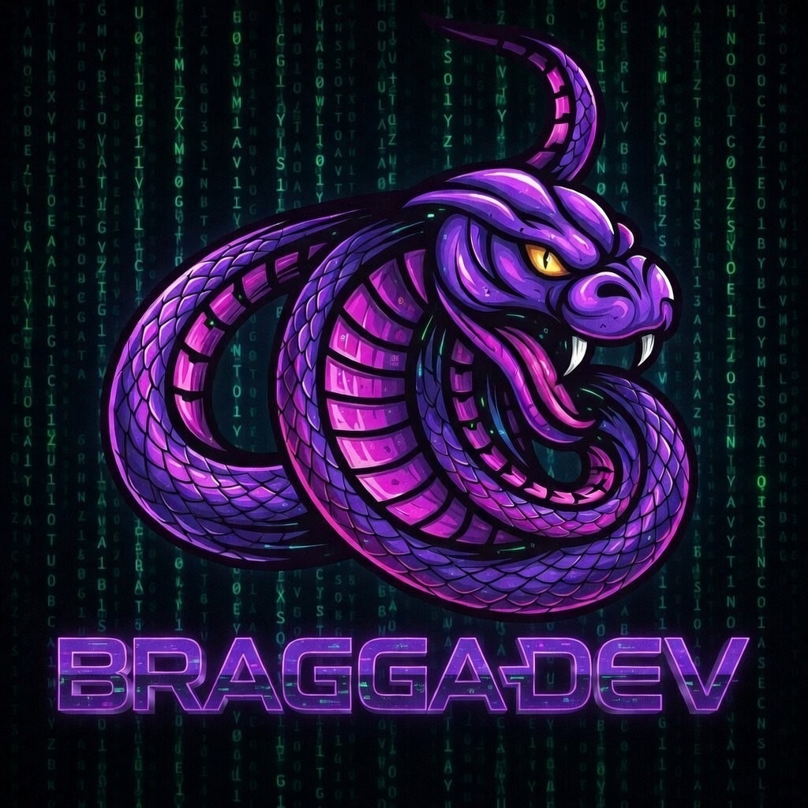

#  BRAGGA DEV

  

  <strong>Desenvolvimento Web & Soluções Inteligentes para impulsionar seu negócio</strong>

  <a href="#sobre">Sobre</a> •
  <a href="#serviços">Serviços</a> •
  <a href="#portfolio">Portfólio</a> •
  <a href="#tecnologias">Tecnologias</a> •
  <a href="#como-rodar">Como Rodar</a> •
  <a href="#contato">Contato</a>

---

## 📱 Sobre o Projeto

**BRAGGA DEV** é uma plataforma web desenvolvida com Django, focada em apresentar serviços de desenvolvimento de software, automação e soluções inteligentes utilizando Inteligência Artificial. O projeto serve como portfólio profissional e vitrine para pequenos e médios negócios que buscam transformação digital.

### 🎯 Objetivos

- Criar uma presença digital profissional e impactante
- Apresentar serviços de desenvolvimento web e automação
- Integrar soluções com inteligência artificial e chatbots
- Servir como base para futuros produtos SaaS
- Gerar leads e oportunidades de negócio

---

## ✨ Funcionalidades

- **Hero Section** com apresentação dinâmica e chamada para ação
- **Seção Sobre** destacando diferenciais e valores da empresa
- **Catálogo de Serviços** com cards interativos:
  - Sites Profissionais
  - E-commerce Completo
  - Chatbots Inteligentes
  - APIs & Integrações
  - Inteligência Artificial
  - Sistemas Web Sob Medida
- **Portfólio de Projetos** com filtros por categoria
- **Formulário de Contato** com validação e tratamento de erros
- **Design Responsivo** com Tailwind CSS
- **Animações e Interatividade** para melhor experiência do usuário
- **Integração com WhatsApp** para atendimento direto

---

